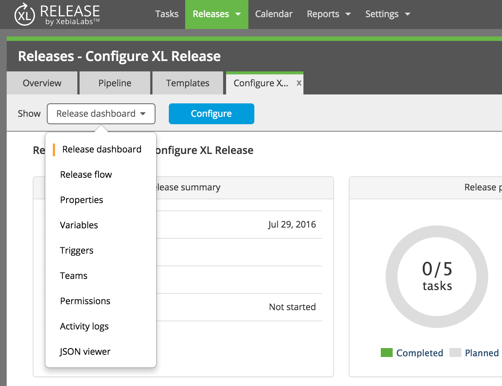
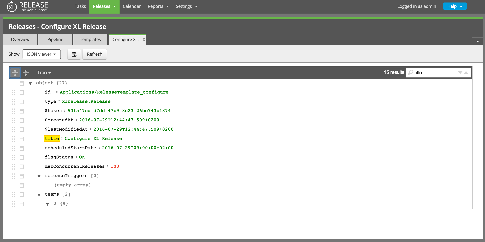
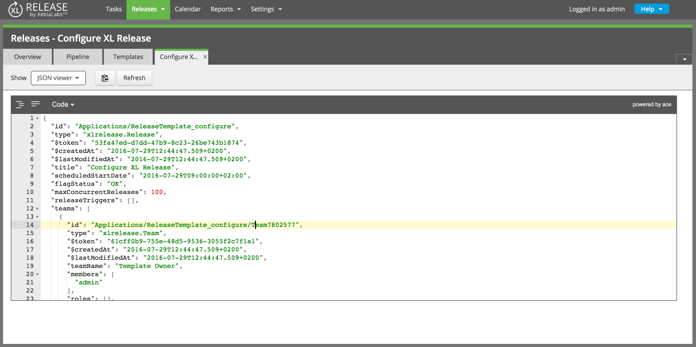

# Overview

This project is a plugin wich is developed to extend functionality of XL Release 5.x with possibilities to view JSON representation of given release or template and copy this JSON to clipboard for use in another tool.

See some screenshots below:

* JSON viewer option in release header dropdown:

* JSON viewer in tree mode with title highlighted:

* JSON viewer in code mode:


This project was generated using [XL Release Plugin Generator](https://github.com/xebialabs/generator-xl-release-plugin).

## Setup

Before you can use this project, you must install and configure the following dependencies on your machine:

1. [Node.js](https://nodejs.org/en/): Depending on your system, you can install Node either from source or as a pre-prepackaged bundle. After installing Node, you should install [Yeoman](http://yeoman.io) using:

    `npm install -g yo`

2. [XL Release](https://xebialabs.com/products/xl-release/): A local distribution of XL Release should be available on you system. An accompanying valid licence should also be available.

3. [Gradle](http://gradle.org/): This project uses the [Gradle Plugin for XL Release](https://github.com/xebialabs/gradle-xl-release-plugin-plugin) for development. For the plugin to work you have to configure the following properties (they can be set either in your global gradle.properties or a local gradle.properties located in the root of the project):

    * `xlReleaseHome` - the location of the XL Release distribution
    * `xlReleaseLicence` - the location of the XL Release licence 


## Development

### Starting/stopping XL Release in plugin development mode

To (re)start the XL Release instance in plugin development mode you can run:

    ./gradlew startXLRelease
    
or just `./gradlew start`.

To stop the XL Release instance you can run:

    ./gradlew stopXLRelease
    
or just `./gradlew stop`.
    
The XL Release log files can be found at `build/server/log/xl-release.log`.

When developing you only need to restart XL Release server when you change `synthetic.xml` or `xl-rest-endpoints.xml`, the changes in Jython scripts, JavaScript, CSS and HTML are picked up on any browser refresh, so your development cycle can be faster. Please read more about it in [the docs of XL Release Gradle plugin](https://github.com/xebialabs/gradle-xl-release-plugin-plugin).

### Generating a new task

Position yourself in the root of the project then run:

`yo xl-release-plugin:task`

You will be asked a series of questions regarding your new task:

* `? Task namespace`
* `? Task name`

After answering all questions a basic file / folder structure will be created.

### Generating a new tile

Position yourself in the root of the project then run:

`yo xl-release-plugin:tile`

You will be asked a series of questions regarding your new task:

* `? Tile namespace`
* `? Tile name`
* `? Tile label`
* `? Use default controller?`
* `? Add details view?`

After answering all questions a basic file / folder structure will be created.

### Project structure

The following shows a sample generated XL Release plugin, the Greeting plugin. It defines a task, the GreeterTask, and a tile, the HelloTile.

```
xlr-greeting-plugin
├─ README.md
├─ build.gradle
├─ gradle
│   └─ wrapper
│       ├─ gradle-wrapper.jar
│       └─ gradle-wrapper.properties
├─ gradlew
├─ gradlew.bat
├─ karma.conf.js // Front end test runner configuration
├─ package.json
├─ settings.gradle
└─ src
    ├─ main
    │   └─ resources
    │       ├─ greeter // GreeterTask namespace
    │       │   ├─ GreeterTask.py // GreeterTask script
    │       │   ├─ GreeterTaskUtils.py // GreeterTask utility module
    │       │   └─ __init__.py
    │       ├─ hello // HelloTile namespace
    │       │   └─ HelloTile.py // HelloTile script
    │       ├─ synthetic.xml // Type definitions
    │       ├─ web
    │       │   └─ include // tile front end
    │       │       └─ hello // HelloTile namespace
    │       │           └─ HelloTile // HelloTile front end
    │       │               ├─ css
    │       │               │   └─ hello-tile.css
    │       │               ├─ hello-tile-summary-view.html
    │       │               ├─ img
    │       │               └─ js
    │       │                   └─ hello-tile.js // HelloTile Angular module
    │       ├─ xl-rest-endpoints.xml // Custom REST endpoints
    │       └─ xl-ui-plugin.xml // UI extension definitions
    └─ test
        ├─ javascript // front end tests
        │   └─ unit
        │       └─ hello
        │           └─ HelloTile
        │               └─ hello-tile-controller.spec.js
        └─ jython // Jython tests
            ├─ test_greeter
            │   ├─ __init__.py
            │   └─ test_GreeterTaskUtils.py
            └─ xlunittestrunner
                └─ runtests.py // unittest test runner script
```

## Testing

Front end unit tests are run by [Karma](https://karma-runner.github.io) and written with [Jasmine](http://jasmine.github.io/). They are located in `src/test/javascript/unit` and can be run with:

    `npm test` or `./gradlew testJavaScriptUnit`
    
End-to-end tests are run by [Protractor](http://www.protractortest.org/) and are located in `src/test/javascript/e2e`. They can be run with:
                                                                                            
    `npm run protractor` or `./gradlew testEnd2End`


Jython tests by default use [unittest](https://docs.python.org/2.7/library/unittest.html). They are located `src/test/jython` and can be run with:

    `./gradlew testJython`

unittest uses predefined pattern for matching test files. By default it's `test*.py` but can be changed by editing the `runtests.py` script.

## <a name="building">Building

This project uses the [gradle-git plugin](https://github.com/ajoberstar/gradle-git). The generated `build.gradle` contains commented out sections that configure the plugin. To be successfully able to build the project uncomment those lines and initialize a new Git repository and make an initial commit (if you haven't already). Now when building the project will contain a valid `plugin.version` field and can be droped into a XL Release distribution. To build the project run:

    `./gradlew build`

## Releasing

This project uses the [gradle-git plugin](https://github.com/ajoberstar/gradle-git). To enable the plugin see the [Building](#building) section. You can release a new version of this project using following sample commands:

* to release a new patch release: `./gradlew release -Prelease.scope=patch -Prelease.stage=final`
* to release a new minor release candidate: `./gradlew release -Prelease.scope=minor -Prelease.stage=rc`

Note that your Git repository must be clean to run any stage except for default `dev`.
